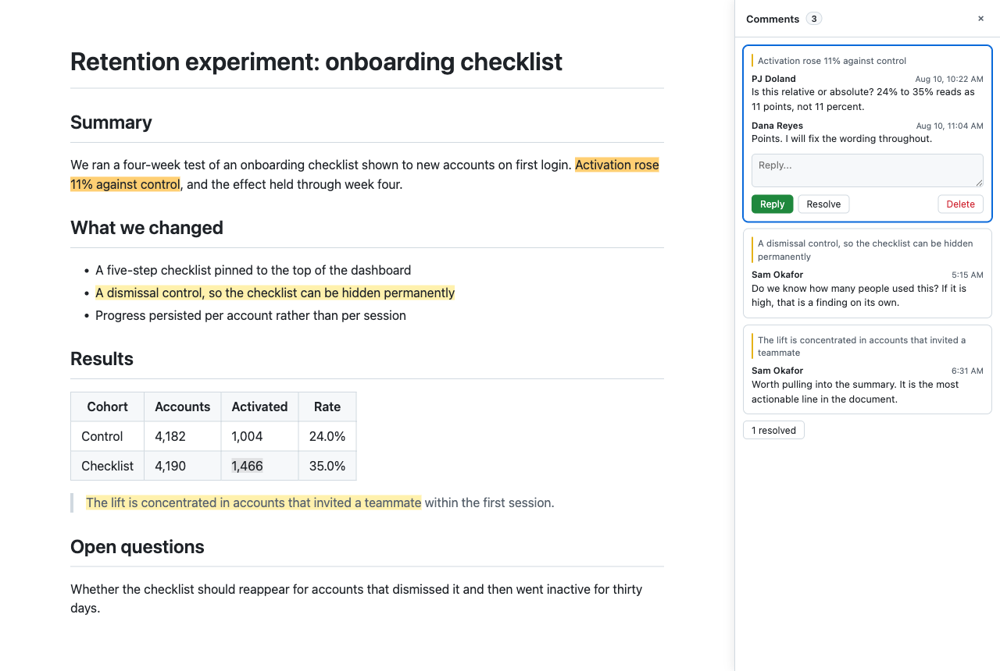
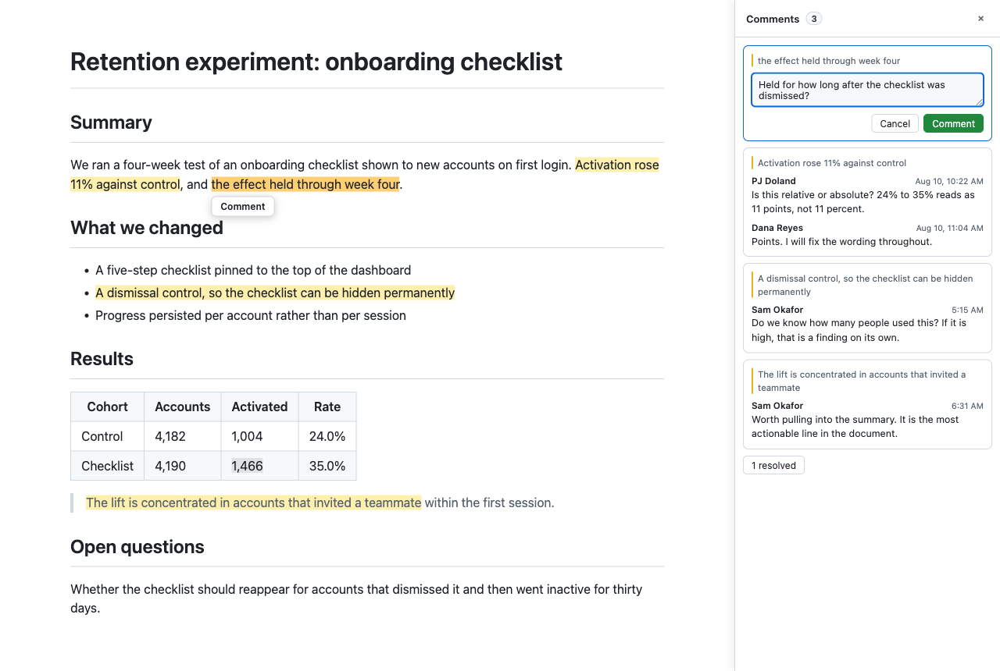
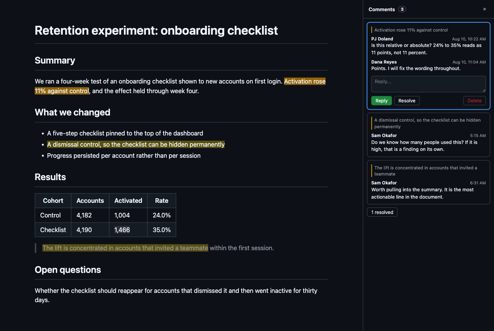

# Markdown Comments

Google Docs style comments on Markdown files, right where you read them on
github.com. The comments live inside the `.md` file itself.



## Why

Reviewing a design doc in a pull request means arguing about diffs. Moving it to
Google Docs means it stops living in the repository. This keeps the document
where it belongs and adds the part that was missing: select a phrase, say
something about it, get a reply.

Because a comment is written into the Markdown, there is no database, no service,
and no sidecar file to lose. Anyone who opens that file on github.com without
this extension still sees the entire discussion, rendered as ordinary footnotes.

## Install

Not on the Chrome Web Store yet. Load it unpacked:

1. Open `chrome://extensions`
2. Turn on **Developer mode**
3. Choose **Load unpacked** and select this directory
4. The setup page opens by itself. Add a
   [fine-grained personal access token](https://github.com/settings/tokens?type=beta)

Until a token is saved, the toolbar icon carries a badge, since an extension
that needs setup before it can do anything has no other way to say so. If you
only ever read public repositories, the setup page has a link to turn that
reminder off.

The token needs **Contents: read and write**, and it must list the repositories
you want to comment in. Fine-grained tokens grant access per repository, so a
valid token is not the same as one that can reach a given repo. The options page
has a **Check repository access** button that tells you which you have.

Reading public repositories works with no token at all.

**Privacy.** No server, no analytics, no telemetry. The token and everything else
stay on your machine, and the only thing the extension talks to is GitHub's API,
using your token, on your behalf. See the [privacy policy](docs/PRIVACY.md).

## Using it

It runs anywhere GitHub renders Markdown from a repository:

| Page | Renders |
| --- | --- |
| `github.com/owner/repo/blob/main/notes.md` | that file |
| `github.com/owner/repo` | the repository README |
| `github.com/owner/repo/tree/main/docs` | that directory's README |

**Leave a comment.** Select text in the document and a Comment button appears.
Type, submit, and it is committed and pushed immediately.



**Everything else.** Click a highlight to jump to its thread, or a thread to jump
to its highlight. Select a thread to reply, resolve, or delete it. Replying to a
resolved thread reopens it.

**When the text a comment was on gets edited**, the thread is orphaned and moves
to the bottom of the document. If the passage still reads like the one it was
written about, the panel offers to put it back and shows how close the match is.
Re-anchoring is a commit, so it happens only when you accept, and a match that is
merely plausible is not offered at all.

**From the keyboard**, <kbd>j</kbd> and <kbd>k</kbd> move between threads,
<kbd>r</kbd> puts the caret in the reply box, and <kbd>e</kbd> resolves or
reopens. They apply while the panel is open and you are not typing.

**Show or hide the panel** with the toolbar icon, <kbd>Alt</kbd>+<kbd>C</kbd>, or
the floating Comments button. The choice is remembered, and the shortcut can be
rebound at `chrome://extensions/shortcuts`. The panel narrows the page rather
than covering it, and it follows your GitHub theme.



Open pages re-check the file every minute, so comments from other people arrive
without a reload. If you are part-way through writing something, the update is
announced instead of applied, so nothing you typed is lost.

Every action is a single commit through the GitHub Contents API, using the blob
SHA for optimistic concurrency. If someone else changed the file since you loaded
it, your write fails cleanly instead of overwriting their edit.

If the branch does not take direct commits, which is the normal state of the
branch a design doc actually lives on, the comment is not lost. The panel offers
to put it on a new branch and open a pull request for it, and links the result.

## How comments are stored

Three pieces, all inside the document:

```markdown
Activation rose <!--mdc:a1b2c3d4-->11% against control<!--/mdc:a1b2c3d4-->[^mdc-a1b2c3d4], and it held.

<!-- mdc-comments-begin -->
<!-- mdc-comments-data
{"v":1,"threads":[
{"anchor":"11% against control","id":"a1b2c3d4","replies":[...],"status":"open"}
]}
-->

[^mdc-a1b2c3d4]:
    **@pjdoland** · Aug 10, 2026: Relative or absolute?

    **@dreyes** · Aug 10, 2026: Points. Fixing the wording.

<!-- mdc-comments-end -->
```

The **anchor pair** marks the commented range and is invisible in every Markdown
renderer, so the prose reads normally. The **JSON block** is the authoritative
copy and the only thing the extension parses. The **footnote definitions** are
the human-visible layer: GitHub turns the reference into a superscript at the
comment site, and the `@handle` into a real profile link.

Everything from the begin sentinel onward is regenerated on every save, so the
visible layer cannot drift from the JSON. A file with no comments is left byte
for byte alone.

The JSON block carries a version and puts one thread per line. The version means
the next change to the shape can be a migration rather than a break; the line per
thread means two branches that each add a comment conflict on their own lines
instead of on the whole block. Readers still accept the unversioned array that
came before.

Two rules in the format are load-bearing and easy to get wrong:

**A reference leads a block-initial anchor.** In CommonMark a line beginning with
`<!--` starts an HTML block, which swallows the rest of the line, strips the
markers, and leaves `[^mdc-...]` rendered as literal text. So when the opening
marker is the first thing on its line, the reference goes in front of it and the
line stays ordinary Markdown. Where a thread has several such markers, each one
gets its own reference; GFM allows a footnote to be referenced more than once.

**Orphans get no footnote definition.** GitHub renders an unreferenced definition
as literal text, so a thread whose anchored text was deleted moves to a plain
"Unanchored comments" list instead of being dropped.

Changing the `mdc-` prefix is a breaking change: it orphans the comments in every
document already written.

[docs/FORMAT.md](docs/FORMAT.md) specifies all of this precisely enough to write
another implementation against. Its conformance vectors are generated from this
codec and checked by `test/format-spec.test.js`, so the specification cannot
quietly drift from the code.

## How it works

GitHub strips HTML comments from its rendered output, so the anchor markers are
invisible in the DOM and the raw source has to be fetched separately. What does
survive is the footnote reference, sitting at exactly the end of the anchored
range, or the start for a block-initial anchor. Recovering the range is then a
walk of that many characters from the reference, which stays unambiguous even
when the same phrase appears elsewhere in the document.

| File | Role |
| --- | --- |
| `src/codec.js` | The file format: parsing and regenerating the comment region |
| `src/content/anchor.js` | Finds each thread's range in the rendered DOM and highlights it |
| `src/content/sourcemap.js` | Maps a rendered selection back to an offset in the raw Markdown, and finds where an orphaned thread's text went |
| `src/content/markdown.js` | Renders reply text, as elements rather than as HTML |
| `src/content/panel.js` | The comments panel |
| `src/content/main.js` | Orchestration, soft navigation, polling, commit flow |
| `src/background.js` | GitHub API calls, so the token never enters a page context |

Highlights use the CSS Custom Highlight API rather than wrapping text in spans.
GitHub's blob view is a React tree and injected elements get discarded on
re-render, so the highlights live outside the DOM entirely.

The source map only has to be good enough to *locate* a phrase, not to render
one. Every result is verified before use and an unverifiable match is refused,
because anchoring a comment to the wrong words is worse than declining to anchor
it at all.

## Development

No build step. This is plain JavaScript, loaded directly by Chrome.

```bash
node --test test/*.test.js           # everything

node --test test/codec.test.js       # the file format
node --test test/sourcemap.test.js   # selection to source mapping, and re-anchoring
node --test test/markdown.test.js    # the reply Markdown subset
node --test test/format-spec.test.js # docs/FORMAT.md against the codec
```

The DOM layer has no automated coverage. Both halves of it, how GitHub renders
footnotes and how it strips comments, are only observable in a real browser
against real rendered output, so they are checked by hand.

`./package.sh` builds the Chrome Web Store ZIP. It packs an explicit list rather
than excluding things, so a new directory is absent from the package until
someone names it, and it refuses to build if the manifest points at a file that
is not there or if a shipped source is not clean UTF-8. Listing copy, permission
justifications and the data disclosures live in
[docs/STORE_LISTING.md](docs/STORE_LISTING.md); store images are in `store/`.

## Limitations

- **It comments, it does not edit.** GitHub's rendered view is not an editor, so
  this adds a discussion layer rather than a way to rewrite prose.
- **Comments cannot nest.** Selecting text that overlaps an existing comment is
  refused. Overlapping ranges cannot be represented unambiguously, and an editor
  that round-trips the markers can silently drop the inner pair.
- **The page's own footnote layer stops updating once you write.** GitHub
  rendered it before the commit and nothing in the browser can re-render it. The
  panel is the live copy, and the stale layer is hidden rather than shown wrong,
  so it reappears correct on the next ordinary page load.
- **A comment that arrives while you are reading may not highlight.** The page
  render predates it, so there is no reference to anchor against. The thread
  still appears in the panel, and the highlight is recovered when its anchor text
  occurs exactly once.
- **Selections spanning images or emoji shortcodes may not map.** They render as
  elements with no text, so the projection and the DOM disagree. The extension
  refuses rather than guessing.
- **GitHub's DOM will change.** Extensions that inject into someone else's site
  need periodic repair. When that happens the failure is silent, so the panel has
  a **Diagnostics** view that says which parts of the page it could and could not
  find, and a button to copy the lot into a bug report.

## License

Copyright (c) 2026 PJ Doland. All rights reserved. See [LICENSE](LICENSE).

The source is readable here, which is not the same as licensed: no permission is
granted to use, copy, modify, or redistribute it. Ask if you want some.
